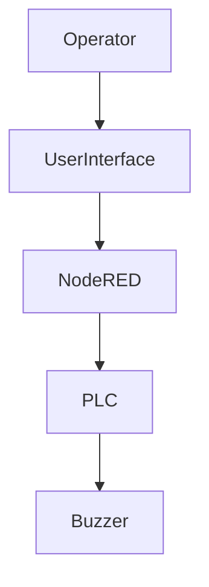
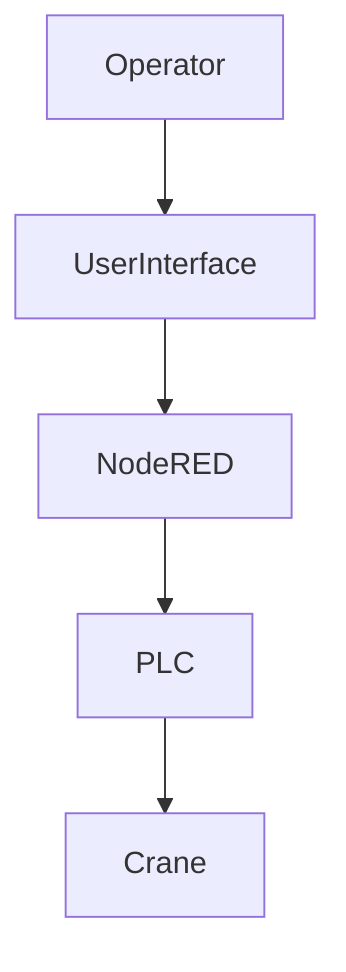
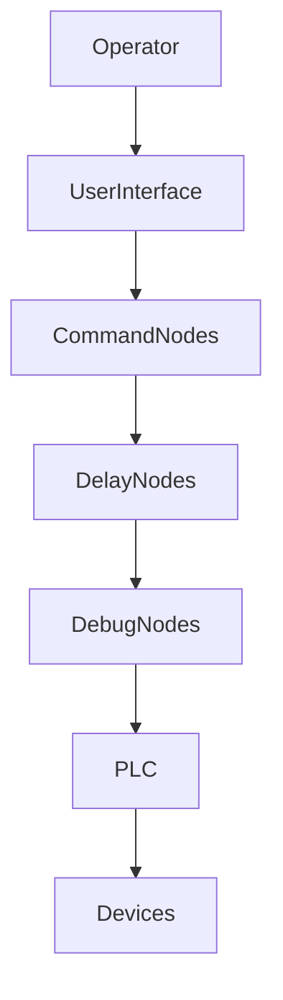
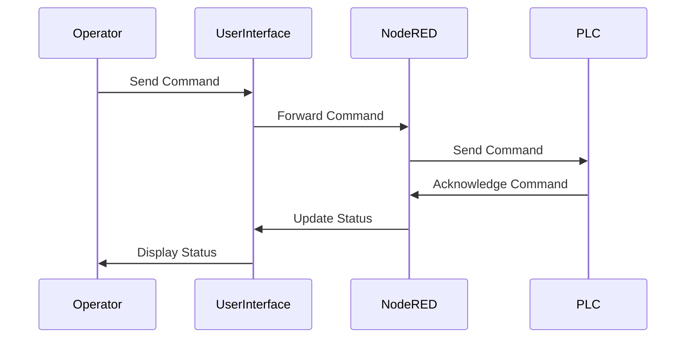
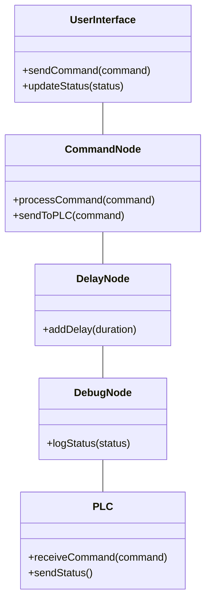
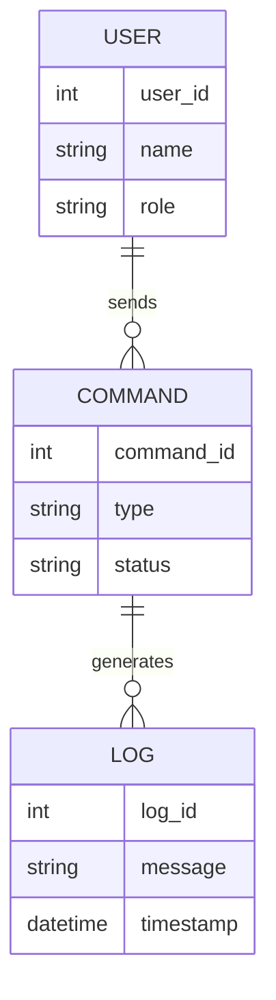
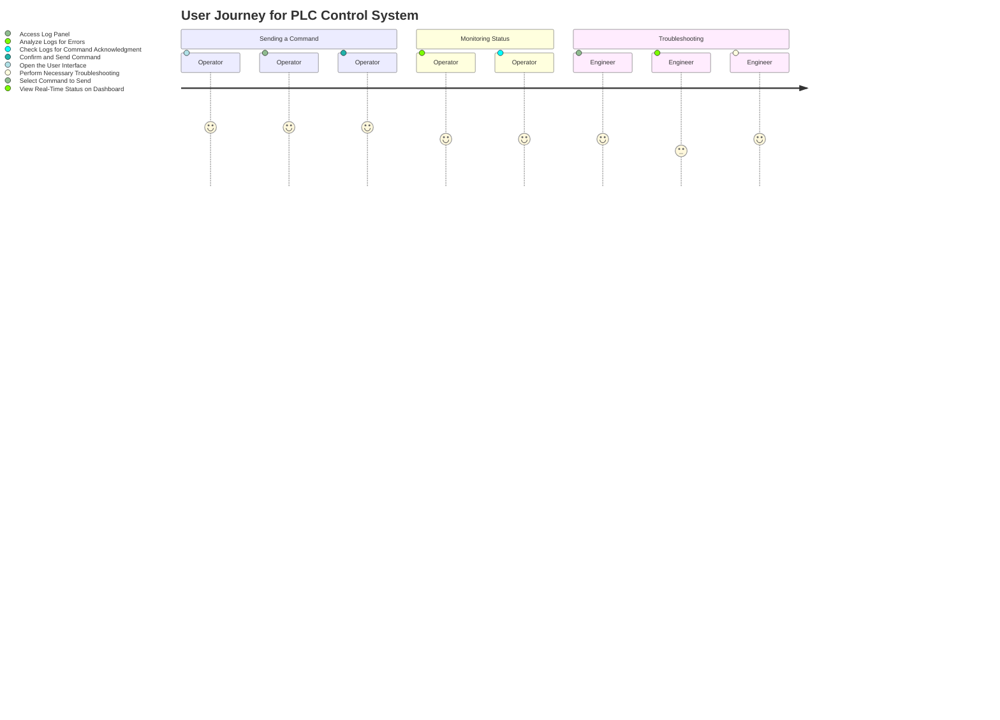

# BOEING  - Software Requirements Specification (SRS) 

## 1. Introduction

### 1.1 Purpose
This Software Requirements Specification (SRS) document provides a comprehensive overview of the PLC control system developed using Node-RED. This document aims to define the system’s functionalities, requirements, constraints, and interactions to ensure a clear understanding among all stakeholders.

### 1.2 Scope
The PLC control system is designed to facilitate industrial automation by enabling operators to send commands to a Programmable Logic Controller (PLC). The system primarily focuses on buzzer control and crane operations. This SRS outlines the essential requirements for developing, testing, and maintaining the system.

### 1.3 Definitions, Acronyms, and Abbreviations
- **PLC**: Programmable Logic Controller
- **Node-RED**: Flow-based development tool for visual programming
- **SRS**: Software Requirements Specification

### 1.4 References
- Node-RED Documentation: [Node-RED Documentation](https://nodered.org/docs/)
- Modbus Protocol Standards: [Modbus Protocol](https://modbus.org/)

### 1.5 Overview
This document details the functional and non-functional requirements, system architecture, user interface, and maintenance aspects of the PLC control system.

## 2. Overall Description

### 2.1 Product Perspective
The PLC control system integrates into the broader industrial automation ecosystem. It enables human operators to interact with automated processes through a user-friendly interface, ensuring efficient management and control of critical operations.

### 2.2 Product Features
- **Buzzer Control**: Commands to activate and deactivate the buzzer.
- **Crane Operations**: Commands to stop and release the crane.
- **User Interface**: Intuitive dashboard for operators.
- **Logging and Debugging**: Detailed logs for monitoring and troubleshooting.

### 2.3 User Classes and Characteristics
- **Production Operators**: Require an easy-to-use interface to control PLC operations.
- **Control Engineers**: Need access to detailed logs and system status for maintenance and troubleshooting.

### 2.4 Constraints
- The system must be developed using Node-RED.
- Communication with the PLC must use the Modbus TCP protocol.
- The system must ensure high availability and security.

### 2.5 Assumptions and Dependencies
- Reliable network communication between Node-RED and the PLC.
- Users have basic training in operating the system.

## 3. Specific Requirements

### 3.1 Functional Requirements

#### 3.1.1 Buzzer Control
- **Description**: The system must allow operators to clear the buzzer by sending a command to the PLC.
- **Acceptance Criteria**: The buzzer should be deactivated within 3 seconds of sending the command.

#### 3.1.2 Crane Stop
- **Description**: The system must allow operators to stop the crane by sending a command to the PLC.
- **Acceptance Criteria**: The crane should stop within 3 seconds of sending the command.

#### 3.1.3 Crane Release
- **Description**: The system must allow operators to release the crane by sending a command to the PLC.
- **Acceptance Criteria**: The crane should be released within 3 seconds of sending the command.

### 3.2 Non-Functional Requirements

#### 3.2.1 Performance
- **Description**: The system must process and send commands to the PLC within 1 second.
- **Acceptance Criteria**: Average command processing time should be below 1 second.

#### 3.2.2 Reliability
- **Description**: The system must maintain 99.9% uptime.
- **Acceptance Criteria**: System availability should be at least 99.9%.

#### 3.2.3 Usability
- **Description**: The interface must be intuitive for production operators.
- **Acceptance Criteria**: Operators should be able to perform tasks with minimal training.

#### 3.2.4 Security
- **Description**: Only authorized users should be able to send critical commands.
- **Acceptance Criteria**: Authentication and access control must be implemented.

## 4. System Models and Diagrams

### 4.1 Flow Diagrams

#### 4.1.1 General Flow Diagram

### 4.2 Sequence Diagrams

#### 4.2.1 Command Sequence

### 4.3 Class Diagrams

#### 4.3.1 System Classes

### 4.4 Entity Relationship Diagram

#### 4.4.1 System Entities

## 5. User Interface

### 5.1 Overview
The user interface is designed to be intuitive and user-friendly, allowing operators to send commands and monitor system status with ease. It consists of the following components:

- **Dashboard**: Displays real-time status of the PLC and connected devices.
- **Command Panel**: Allows operators to send commands to the PLC.
- **Log Panel**: Shows detailed logs for debugging and monitoring.

### 5.2 User Journey

## 6. HTML Integration

### 6.1 Overview
The user interface is built using HTML, CSS, and JavaScript to provide a responsive and interactive experience. The HTML components are designed to integrate seamlessly with Node-RED, enabling real-time updates and command execution.

### 6.2 Components
- **Dashboard**: Displays real-time data and status indicators.
- **Command Panel**: Provides buttons and input fields for sending commands.
- **Log Panel**: Displays logs and system messages for monitoring and debugging.

## 7. Maintenance and Support

### 7.1 Logging and Monitoring
The system includes comprehensive logging and monitoring capabilities to track command execution and system status. Logs are accessible through the user interface and can be exported for further analysis.

### 7.2 Updates and Upgrades
Regular updates and upgrades will be provided to ensure the system remains secure and up-to-date with the latest features and improvements.

### 7.3 Technical Support
Technical support is available to assist with any issues or questions related to the system. Support includes troubleshooting, bug fixes, and guidance on system usage.

## 8. Appendices

### 8.1 Glossary
- **PLC**: Programmable Logic Controller
- **Node-RED**: Flow-based development tool for visual programming
- **Modbus**: Communication protocol used with PLCs

### 8.2 References
- Node-RED Documentation: [Node-RED Documentation](https://nodered.org/docs/)
- Modbus Protocol Standards: [Modbus Protocol](https://modbus.org/)

This concludes the Software Requirements Specification for the PLC control system.

